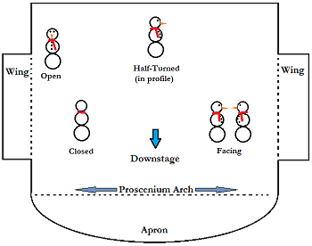
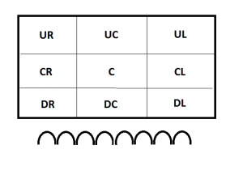

<html>
	<head>
			<title>Theater</title>
	</head>
		
			<Body background="curtain.jpg">
				<h1 Style="color:White;" align="center">My Hobby: Theater Production </h1>
					

				        <table width=100%>
							<tr><th><a href="file:///C:/Users/AAMyhre19/Documents/Website/Page2.html" style="color:White;float:left;">
							 Backstage production 
                                </a></th>
                            <th><a href="file:///C:/Users/AAMyhre19/Documents/Website/Website.html" style="color:White;float:right;">
							     Acting 
							     </a></th></tr>
                       </table>
			

				<h1 style="color:Yellow;" align="center">Acting in Plays</h1>
             
                <table width=100%>
				    <tr><th>  </th>
                        <th></tr></th>
            </table>      
            

                        As an actor, you have to be able to adapt on your feet and be able to emerge yourself in a character. At first, it is very nerve wrecking but after the first few shows you get less nervous and just get caught in preforming.I have been preforming in plays for two years and I have honestly loved every minute of it. Everything about getting ready is just so much fun especially since you become best friends with your fellow cast members and have a ton of fun acting.

           

<h1 style="color:yellow;" align="center"> So What is the Process of Acting in a Play? </h1>
    

        It all starts with the play: first we start of deciding what kind of play we would like to do, it's either a comedy or a drama. Then, we see how man actors and actresses we have for the genre we want to do and pick a play accordingly. Most plays require that you pay a royalty fee in order to use the play and that can range anywhere from free to thousands of dollars. Once you've gotten your scripts and your cast, next up is auditions. Depending on the director, auditions can be either stressful or quite easy. Some directors just like to get a cast together and have them read from the script and see how they do. Others just want you to read monologues or act our a scene. The latter is much harder as you do this solo and its very nervewrecking. After you've been casted the next step is blocking. 
        

<h1 style="color:yellow;" align="center"> What is Blocking? </h1>
    <table width=100%>
            <tr><th>  </th>
            <th>  </th></tr>
    </table>
        

            Blocking is the movement that actors do during a preformance. These movements are necesary, not only can they add to the dramatic effect but these movements are often necessary to make the actors more life-like and to keep the play rolling. it is a very crucial step for actors to know their blocking because if they enter or exit at the wrong time ot forget to make a movement they may throw the whole performance off track. There a couple of crucial rules when it comes to blocking:
            

                    <ol style=color:white;">
                        <li> don't turn your back to the audience </li>
                        <li> Always remain open to the audience (this applies to your foot stance and which arms you use)</li>
						<li> Do not look straight ahead at someone on stage </li>
                                                           </ol>
      
              <a href="https://www.thoughtco.com/blocking-a-play-2713052" style="color:white;"> 
                                       You can learn more about blocking here
                                                                                         </a>
          

    
 
                 Ater you block and learn your lines, its time to step out into the limelight and act. But,There are two sides to a show, if you'd like to learn more about the technical side then click the link at the top of the page!
    

 
    <h3 style="color:yellow; border:2px solidblack;" align="center"> Austin Myhre, Period 1, My Hobby: Theater <h3>
    </body>
		
</html>
